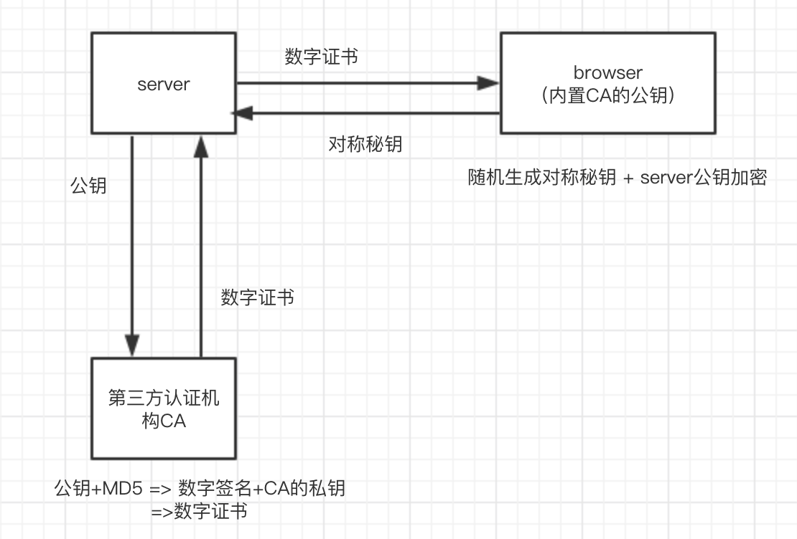

# 原文：https://ddduanlian.github.io/2018/06/22/http_note/

## 1. HTTP/0. 9

1990 年提出的，是最早期的版本，只有一个命令 GET。

## 2. HTTP/1. 0

1996 年 5 月提出的。

- 缺点：每个 TCP 连接只能发送一个请求
- 解决办法：`Connection: keep-alive`

## 3. HTTP/1. 1

支持长连接(PersistentConnection)，TCP 连接默认不关闭，可以被多个请求复用。

默认开启 `Connection: keep-alive`。

HTTP1. 0 规定浏览器和服务器只保持短暂的连接，也需要增加新的请求头来帮助实现，例如，`Connection: keep-alive`时客户端通知服务器返回本次请求结果后保持连接。如果 `Connection: close` 时，客户端通知服务器返回本次连接结果后关闭连接。

### 3. 1 通用首部字段

1. Cache-Control：操作缓存的工作机制

参数：

- public：明确表明其他用户也可以利用缓存
- private：缓存只给特定的用户
- no-cache：客户端发送这个指令，表示客户端不接收缓存过的响应，必须到服务器取；服务器返回这个指令，指缓存服务器不能对资源进行缓存。其实是不缓存过期资源，要向服务器进行有效期确认后再处理资源。
- no-store：指不进行缓存
- max-age：缓存的有效时间（相对时间）

2. Connection：

- Connection：keep-Alive (持久连接)
- Connection：不再转发的首部字段名

3. Date：表明创建 http 报文的日期和时间

4. Pragma：兼容 http1. 0，与 Cache-Control：no-cache 含义一样。但只用在客户端发送的请求中，告诉所有的中间服务器不返回缓存。形式唯一：Pragma：no-cache

5. Trailer：会事先说明在报文主体后记录了哪些首部字段，该首部字段可以应用在 http1. 1 版本分块传输编码中。

6. Transfer-Encoding：chunked （分块传输编码）,
   规定传输报文主体时采用的编码方式，http1. 1 的传输编码方式只对分块传输编码有效

7. Upgrade：升级一个成其他的协议，需要额外指定 Connection：Upgrade。服务器可用 101 状态码作为相应返回。

8. Via：追踪客户端和服务器之间的请求和响应报文的传输路径。可以避免请求回环发生，所以在经过代理时必须要附加这个字段。

### 3.2 请求首部字段

1. Accept：通知服务器，用户代理能够处理的媒体类型及媒体类型的相对优先级
   q 表示优先级的权重值，默认为 q = 1.0，范围是 0~1（可精确到小数点后 3 位，1 为最大值）
   当服务器提供多种内容时，会先返回权重值最高的媒体类型

2. Accept-Charset：支持的字符集及字符集的相对优先顺序，跟 Accept 一样，用 q 来表示相对优先级。这个字段应用于内容协商机制的服务器驱动协商。

3. Accept-Encoding：支持的内容编码及内容编码的优先级顺序，q 表示相对优先级。
   内容编码：gzip. compress. deflate. identity（不执行压缩或者不会变化的默认编码格式）。
   可以使用 `\*` 作为通配符，指定任意的编码格式。

4. Accept-Language：能够处理的自然语言集，以及相对优先级。

### 3.3 状态码

- `101 Switching Protocols` 协议升级, 主要用于升级到 websocket，也可以用于 http2
- `200 OK`
- `204 No Content` 服务器成功处理请求，但是返回的响应报文中不含实体的主体部分
- `206 Partial Content` 表示客户端像服务器进行了范围请求（Content-Range 字段），服务器成功返回指定范围的实体内容
- `301 永久重定向`
- `302 临时性重定向`
- `304 未修改` 协商缓存中返回的状态码
- `307 临时重定向` 与 302 功能相同，但规定不能从 POST 变成 GET

> 当 301、302、303 响应状态码返回时，几乎所有浏览器都会把 post 改成 get，并删除请求报文内的主体，之后请求会自动再次发送。然而 301、302 标准是禁止将 post 方法改变成 get 方法的，但实际使用时大家都会这么做。所以需要 307。

- `400 Bad Request` 表示请求报文中存在语法错误。
- `401 unauthorized` 表示发送的请求需要有通过 HTTP 认证（BASIC 认证、DIGEST 认证）的认证信息。如果之前已经进行过一次请求，表示用户认证失败。

- `403 Forbidden` 表示拒绝对请求资源的访问
- `404 Not Found` 表明服务器上无法找到请求的资源
- `500 Internet Server Error`

## 4. WebSocket

特性：

1. 推送功能：服务器可直接发送数据，不需要等待客户端的请求；
2. 基于 TCP 传输协议，并复用 HTTP 的握手通道；
3. 支持双向通信，用于实时传输消息；
4. 更好的二进制支持；
5. 更灵活，更高效。

### 4.1 建立连接过程

#### 1. 客户端：发起升级请求

```js
GET / HTTP/1.1 `采用HTTP报文格式，只支持get请求`
Host: localhost:8080
Origin: http://127.0.0.1:3000
Connection: Upgrade `表示要升级协议`
Upgrade: websocket `表示升级到websocket协议`
Sec-WebSocket-Version: 13 `表示websocket 的版本`
Sec-WebSocket-Key: w4v7O6xFTi36lq3RNcgctw== `是一个 Base64 encode 的值，是浏览器随机生成的`
Sec-WebSocket-Protocol：chat, superchat `用来指定一个特定的子协议，一旦这个字段有设置，那么服务器需要在建立连接的响应头中包含同样的字段，内容就是选择的子协议之一。`
```

#### 2. 服务端：响应协议升级

```js
HTTP/1.1 101 Switching Protocols    `101表示协议切换==`
Connection:Upgrade
Upgrade: websocket
Sec-WebSocket-Accept: Oy4NRAQ13jhfONC7bP8dTKb4PTU= `经过服务器确认，并且加密过后的 Sec-WebSocket-Key`
Sec-WebSocket-Protocol：chat  `表示最终使用的协议`
```

Sec-WebSocket-Key 的加密过程为：

> 1. 将 Sec-WebSocket-Key 跟 258EAFA5-E914-47DA-95CA-C5AB0DC85B11 拼接。
> 2. 通过 SHA1 计算出摘要，并转成 base64 字符串。

#### 3. 双方握手成功后，就是全双工的通信了，接下来就是用 websocket 协议来进行通信了。

### 4.2 Ajax 轮询、长轮询、WebSocket 原理解析

1. 短轮询

让浏览器每隔一定的时间就发送一次请求，询问服务器是否有新信息。

2. 长轮询

采用的阻塞模式。客户端发起连接后，如果没消息，服务器不会马上告诉你没消息，而是将这个请求挂起（pending），直到有消息才返回。返回完成或者客户端主动断开后，客户端再次建立连接，周而复始。Comet 就是采用的长轮询。

3. websocket

WebSocket 是类似 Socket 的 TCP 长连接通讯模式。一旦 WebSocket 连接建立后，后续数据都以帧序列的形式传输。而且浏览器和服务器就可以随时主动发送消息给对方，是全双工通信。

优点：在海量并发及客户端与服务器交互负载流量大的情况下，极大的节省了网络带宽资源的消耗，有明显的性能优势，且客户端发送和接受消息是在同一个持久连接上发起，实时性优势明显。

## 5. HTTPS

> HTTPS = HTTP + 加密 + 认证 + 完整性保护

它的加密过程是：

1. server 生成一个公钥和私钥，把公钥发送给第三方认证机构（CA）；
2. CA 把公钥进行 MD5 加密，生成数字签名；再把数字签名用 CA 的私钥进行加密，生成数字证书。CA 会把这个数字证书返回给 server；
3. server 拿到数字证书之后，就把它传送给浏览器；
4. 浏览器会对数字证书进行验证，首先，浏览器本身会内置 CA 的公钥，会用这个公钥对数字证书解密，验证是否是受信任的 CA 生成的数字证书；
5. 验证成功后，浏览器会随机生成对称秘钥，用 server 的公钥加密这个对称秘钥，再把加密的对称秘钥传送给 server；
6. server 收到对称秘钥，会用自己的私钥进行解密，之后，它们之间的通信就用这个对称秘钥进行加密，来维持通信。



## 6. CORS

1. 原理

服务器在响应头中设置响应的选项，浏览器如果支持这种方法的话就会将这种跨站资源请求视为合法，进而获取资源。

2. 实现

CORS 分为简单请求和复杂请求，简单请求指的是：

1. 请求方法是一下 3 种方法之一：`HEAD`, `GET`, `POST`

2. HTTP 的头信息不超过以下几种字段：

Accept、Accept-Language、Content-Language、Last-Event-ID、
Content-Type（只限于三个值 application/x-www-form-urlencoded、multipart/form-data、text/plain）。

其他请求就是非简单请求了。

- **简单请求**

1. 请求头

```
Origin: http://www.domain.com
```

2. 响应头

```js
Access-Control-Allow-Origin: http://www.domain.com
Access-Control-Allow-Credentials: true   `是否允许传送cookie`
Access-Control-Expose-Headers: FooBar `CORS请求时，只能拿到6个基本字段：Cache-Control、Content-Language、Content-Type、Expires、Last-Modified、Pragma。如果想拿到其他字段，就必须指定。`

```

3. 另外，ajax 请求中,如果要发送 Cookie，Access-Control-Allow-Origin 就不能设为星号，必须指定明确的、与请求网页一致的域名，还要设置以下内容

```js
var xhr = new XMLHttpRequest();
xhr.withCredentials = true;
```

- **非简单请求**

1. `预检请求`

```js
OPTIONS /cors HTTP/1.1  `OPTIONS请求是用来询问的`
Origin: http://www.domian.com
Access-Control-Request-Method: PUT
Access-Control-Request-Headers: X-Custom-Header

```

2. `响应头`

```js
Access-Control-Allow-Origin: http://www.domain.com
Access-Control-Allow-Methods: GET, POST, PUT  `服务器支持的所有跨域请求的方法`
Access-Control-Allow-Headers: X-Custom-Header  `服务器支持的所有头信息字段，不限于浏览器在"预检"中请求的字段。`
Access-Control-Allow-Credentials: true
Access-Control-Max-Age: 1728000  `指定本次预检请求的有效期，单位为秒`
```

3. 之后的步骤就同简单请求了。
