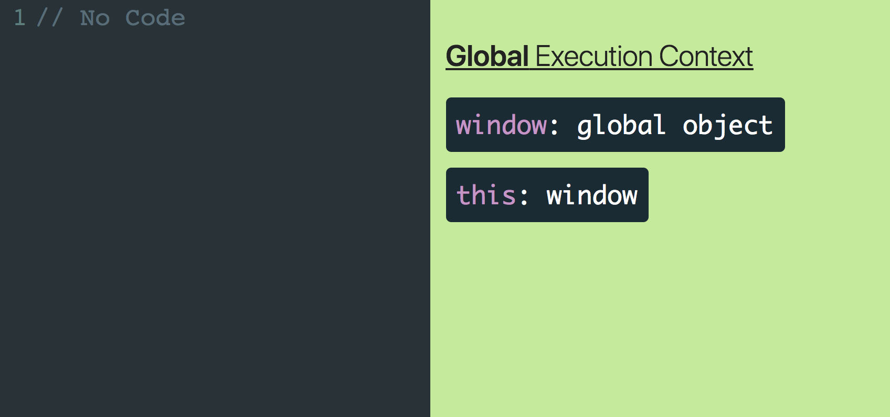
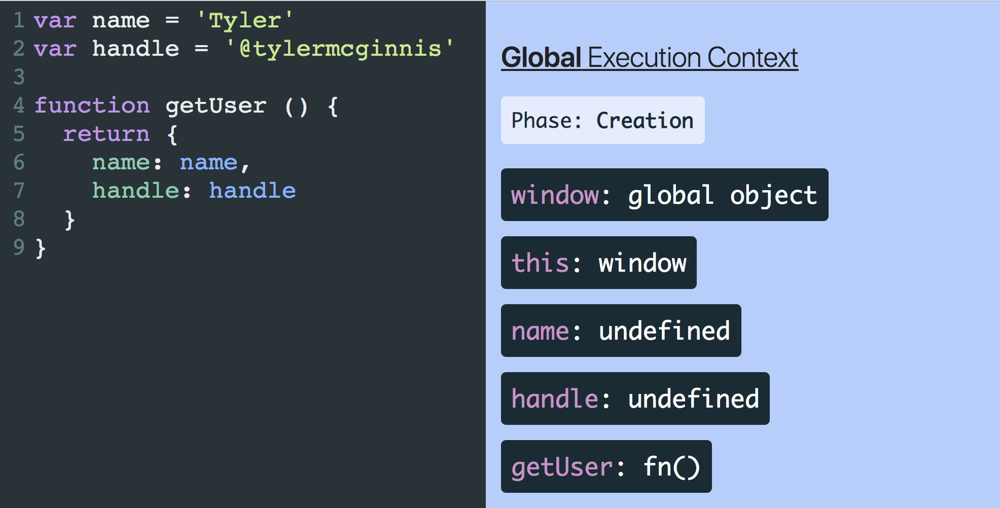
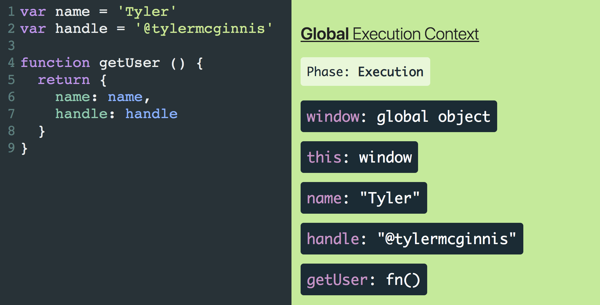
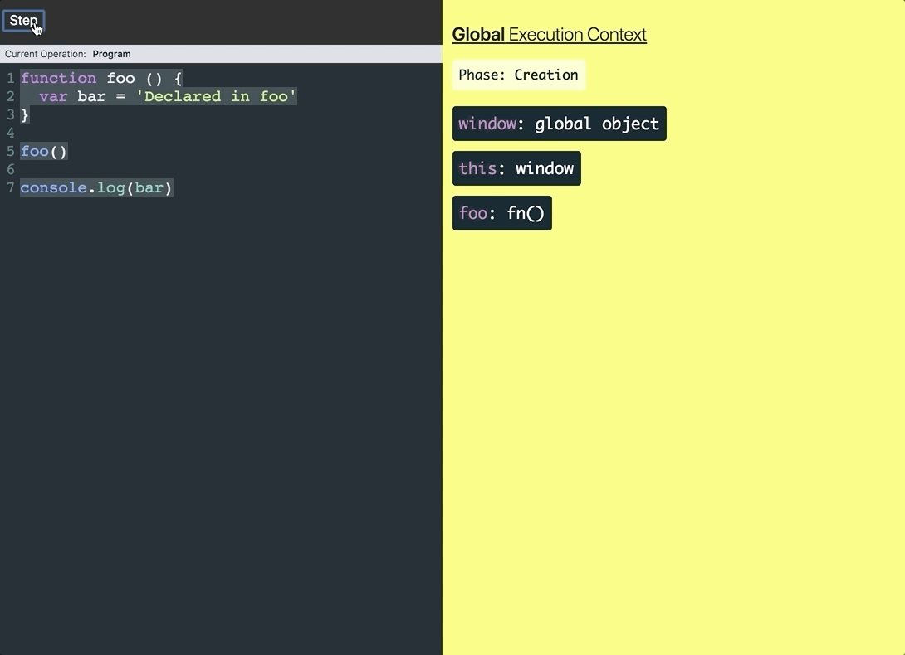

## 编译原理

尽管通常键 JavaScript 归类为“动态”或“解释执行”语言，但事实上它是一门编译语言。但与传统的编译语言不同，它不是提前编译的，编译结果也不能在分布式系统中进行移植。

尽管如此，JavaScript 引擎进行的步骤和传统的编译语言非常类似。

对于 JavaScript 来说，大部分情况下编译发生在代码执行前的几微妙的事件内。

- 引擎：从头到尾负责整个 JavaScript 程序的编译及执行过程。
- 编译器：负责语法分析和代码生成等脏活累活。
- 作用域：负责收集并维护由所有声明的标识符（变量）组成的一系列查询，确定当前执行的代码对这些标识符的访问权限。

## 执行环境

执行环境定义了变量或函数有权访问的其他数据，决定了它们各自的行为。**每个执行环境都有与之关联的变量对象，环境中定义的所有变量和函数都保存在这个对象中**。

全局执行环境是最外围的一个执行环境。在 Web 浏览器中，全局执行环境是 window 对象，所有全局变量和函数都是作为 window 对象的属性和方法创建的。

每个函数都有自己的执行环境。当执行流进入一个函数时，函数的环境就会被推入一个环境栈中。而在函数执行之后，栈将其环境弹出，把控制权返回给之前的执行环境。ECMAScript 程序中的执行流正是由这个方便的机制控制着。

当代码在一个环境中执行时，**会创建变量对象的一个作用域链**。作用域链的用途，是保证对执行环境有权访问的所有变量和函数的有序访问。作用域链的前端，始终都是当前执行的代码所在环境的变量对象。

- 执行环境有全局执行环境和函数执行环境之分。
- 每一次进入一个新执行环境，都会创建一个用于搜索变量和函数的作用域链。

---

当 JavaScript 引擎开始运行你的代码时，所创建的第一个执行环境叫做 "Global Execution Context" 全局执行环境。一开始这个执行环境只包含两个东西，一个全局对象和一个变量 `this`。



现在来添加一些变量：




每个执行环境都有两个单独的阶段，一个 `Creation` 阶段和一个 `Execution` 阶段。
在 `Creation` 阶段，JavaScript 引擎会：

1. 创建一个 `global` 对象
2. 创建一个 `this` 对象
3. 为变量和函数分配内存空间
4. 为变量声明设置一个默认值 `undefined`

只有进入 Execution 阶段时，JavaScript 引擎才会一行一行地运行你的代码。


在 `Creation` 阶段， `window` 和 `this` 对象被创建，变量声明 `name` 和 `handle` 被分配一个默认值 `undefined`，函数声明整个放入内存中，一旦进入 `Execution` 阶段， JavaScript 引擎开始逐行执行代码并且将真实的值赋给内存中的变量。

## 函数执行环境

每当一个函数被调用时，就会创建出一个函数执行环境。

每当一个函数执行环境被创建时，JavaScript 引擎会：

1. 创建一个 `arguments` 对象.
2. 创建一个 `this` 对象.
3. Set up memory space for variables and functions.
4. Assign variable declarations a default value of “undefined” while placing any function declarations in memory.


当调用 `getUser()` 时，一个新的执行环境就被创建出来。在 getUser 这个执行环境的 `Creation` 阶段，JavaScript 引擎创建了一个 `this` 对象和一个 `arguments` 对象。

你可能也主要到了当 `getUser` 函数执行结束时，它在图中消失了，实际上，JS 引擎创建了一个叫 `Execution Stack` 也叫 Call Stack 调用栈。每当一个函数被调用，就会创建一个新的执行环境并添加到调用栈。

### Scope

MDN 将`Scope`定义为当前的执行环境。

```js
function foo() {
  var bar = "Declared in foo";
}

foo();
```



当 `foo()` 被调用时，我们在调用栈上创建了一个新的执行环境。`Creation` 阶段会创建 `this`，`arguments` 并将 `bar`设置为 undefined。然后进入 `Execution` 阶段，将字符串赋值给 `bar`，在`Execution`阶段结束后，`foo()`从调用栈中一处。此时 bar 已经不存在了，所以会报错 "ReferenceError: bar is not defined"。这告诉我们，函数内部声明的变量是局部变量，一旦函数的执行环境从调用栈中退出，就无法访问了。

```js
function first() {
  var name = "Jordyn";

  console.log(name);
}

function second() {
  var name = "Jake";

  console.log(name);
}

console.log(name);
var name = "Tyler";
first();
second();
console.log(name);
```

We get undefined, Jordyn, Jake, then Tyler. 从结果中可以看出，每个新的执行环境都有自己的独特的环境变量。 Each new Execution Context has its own unique variable environment. 即使其他的环境变量包含了同名的变量, the JavaScript 引擎会先从当前的执行环境中查找这个变量，如果找不到再去上一层的执行环境中找。

---

之前我们说过函数内部声明的变量是局部变量，（大多数情况下）一旦函数的执行环境从调用栈中退出后，这个变量就无法访问了。但是在一种情况下这是错误的，就是当你有一个函数嵌套在另一个函数中。在这种情况下， child function 仍然能够访问 outer function 的作用域，即使在 parent function 的执行环境已经被退出调用栈。


